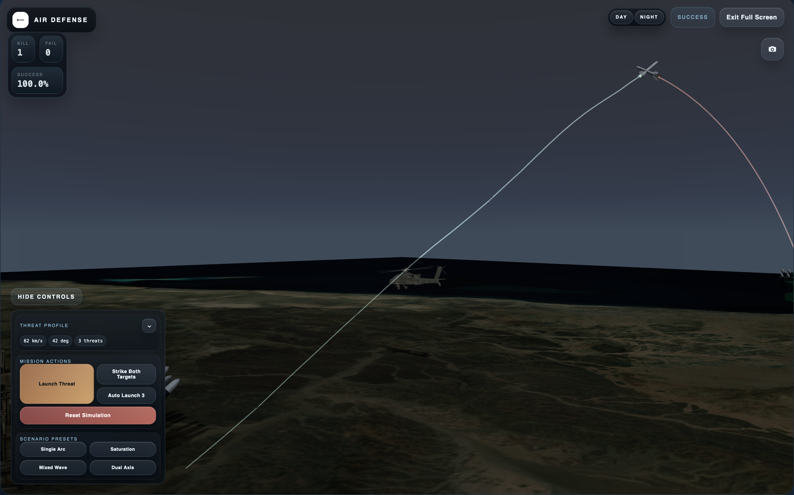

# Air Defense Simulation

Air Defense Simulation is a small full-stack tactical demo built around a live interceptor-vs-threat simulation loop. A FastAPI backend maintains the battlespace state, and a React + Three.js frontend renders that state as a command-console-style 3D experience with launch controls, telemetry, and engagement results.

## Highlights

- Live 3D tactical scene powered by React Three Fiber and Three.js
- FastAPI simulation service with endpoints for launch, reset, and step control
- Operator controls for threat speed, launch angle, threat count, and scenario presets
- Telemetry and results panels that reflect the current mission state in real time
- Day and night presentation modes in the tactical view
- Production-ready config via environment variables and Docker

## Screenshots

### Launch Overview


### Intercept Close-Up



### Multi-Engagement Scenario


## Tech Stack

| Layer | Technologies |
| --- | --- |
| Frontend | React 19, TypeScript, Vite 6, Three.js, React Three Fiber, Drei |
| Backend | Python 3.11+, FastAPI, Uvicorn, NumPy, Pydantic |

## Project Structure

```text
air-def/
├── backend/
│   ├── app/
│   │   ├── main.py          # FastAPI entrypoint
│   │   ├── sim_engine.py    # Core simulation loop
│   │   ├── guidance.py      # Guidance / engagement logic
│   │   ├── tracker.py       # Radar tracking model
│   │   ├── physics.py       # Physics helpers
│   │   └── models.py        # Shared backend schemas
│   └── pyproject.toml
├── docs/
│   └── screenshots/         # README images and project media
├── frontend/
│   ├── public/              # Static models, audio, and branding assets
│   ├── src/
│   │   ├── components/      # Panels and UI shell
│   │   ├── sim/             # Three.js scene wiring
│   │   ├── api/             # Frontend API client
│   │   └── App.tsx          # Main application composition
│   └── package.json
└── README.md
```

## Getting Started

### Prerequisites

- Node.js 20+
- Python 3.11+

### 1. Start the backend

```bash
cd backend
python3 -m venv .venv
source .venv/bin/activate
pip install -e .
uvicorn app.main:app --reload --host 127.0.0.1 --port 8000
```

If editable install gives you trouble, install the dependencies directly instead:

```bash
pip install "fastapi>=0.115" "numpy>=2.1" "pydantic>=2.9" "uvicorn>=0.30"
uvicorn app.main:app --reload --host 127.0.0.1 --port 8000
```

Backend docs are available at [http://127.0.0.1:8000/docs](http://127.0.0.1:8000/docs).

### 2. Start the frontend

```bash
cd frontend
npm install
npm run dev
```

Open [http://127.0.0.1:5173](http://127.0.0.1:5173).

In local development, Vite proxies API calls to the FastAPI server on port `8000`, so you can run the frontend without changing code.

## How To Use The Demo

Once both services are running:

1. Open the command console in the browser.
2. Use the control panel to set threat speed, launch angle, and threat count.
3. Trigger one of the quick threat classes or scenario presets.
4. Watch the tactical scene, telemetry feed, and results panel update as the backend steps the simulation.
5. Use `Reset` to return the battlespace to its initial state.

The UI also includes a `Strike Both Targets` action, automated multi-threat launch behavior, and a fullscreen tactical mode for the 3D stage.

## HTTP API

| Method | Path | Description |
| --- | --- | --- |
| `GET` | `/health` | Health check |
| `GET` | `/state` | Return the current simulation snapshot |
| `POST` | `/scenario/launch` | Launch a threat with `speed`, `angle_deg`, and optional `target_id` |
| `POST` | `/scenario/strike-all` | Trigger the dual-target strike scenario |
| `POST` | `/simulation/step?steps=1` | Advance the simulation by the requested number of steps |
| `POST` | `/simulation/reset` | Reset the simulation state |

Simulation state is stored in memory inside a single API process, so one backend instance represents one live battlespace.

## Frontend Build

```bash
cd frontend
npm run build
npm run preview
```

This produces a static build in `frontend/dist`.

## Deployment

The app now supports a same-origin deployment model:

- the frontend is built into static assets
- the FastAPI backend can serve those assets directly
- API requests default to the current origin in production

### Environment variables

Use `.env.example` as the starting point.

| Variable | Purpose |
| --- | --- |
| `AIR_DEF_APP_ENV` | Set to `production` for deployed environments |
| `AIR_DEF_ALLOWED_ORIGINS` | Comma-separated frontend origins when the frontend is hosted separately |
| `AIR_DEF_SERVE_FRONTEND` | Set to `1` to let FastAPI serve the built frontend |
| `AIR_DEF_FRONTEND_DIST` | Path to the built frontend output |
| `VITE_API_BASE_URL` | Optional override when the frontend must call an external API origin |

### Docker deployment

Build and run the app with:

```bash
docker build -t air-defense-sim .
docker run --rm -p 8000:8000 air-defense-sim
```

Then open `http://127.0.0.1:8000`.

The container builds the Vite frontend, installs the backend, and serves the app from one process.

### Render deployment

This repo includes `render.yaml` for a Docker-based Render web service.

To deploy on Render:

1. Push the repo to GitHub.
2. In Render, choose `New` -> `Blueprint`.
3. Connect this repository.
4. Render will detect `render.yaml` and prefill the service config.
5. Approve the blueprint and deploy.

The Blueprint config sets:

- `runtime: docker`
- `healthCheckPath: /health`
- `AIR_DEF_APP_ENV=production`
- `AIR_DEF_SERVE_FRONTEND=1`
- `AIR_DEF_FRONTEND_DIST=/app/frontend/dist`

After deploy, open the generated `onrender.com` URL.

### Fly.io deployment

This repo also includes `fly.toml` for Fly.io.

The Fly configuration is set up for this app's current architecture:

- Docker-based deploy using the existing `Dockerfile`
- `internal_port = 8000`
- health check on `/health`
- primary region set to `bom` (Mumbai) for lower latency in India
- Machines kept warm by default so the in-memory simulation is not paused by autostop

Before the first deploy:

1. Install `flyctl` and log in with Fly.io.
2. Open `fly.toml` and replace `replace-with-your-fly-app-name` with your real Fly app name.
3. From the repo root, run:

```bash
fly launch --no-deploy
fly deploy
```

Useful follow-up commands:

```bash
fly status
fly logs
fly checks list
```

If you want to move the app closer to your users, Fly supports region placement and currently includes `bom` for Mumbai. See the official references for [regions](https://fly.io/docs/reference/regions/), [Dockerfile deploys](https://fly.io/docs/languages-and-frameworks/dockerfile/), [launch](https://fly.io/docs/flyctl/launch/), [deploy](https://fly.io/docs/flyctl/deploy/), and [fly.toml configuration](https://fly.io/docs/reference/configuration/).

### Non-Docker deployment

1. Build the frontend with `npm run build` inside `frontend/`.
2. Set `AIR_DEF_APP_ENV=production`.
3. Set `AIR_DEF_SERVE_FRONTEND=1`.
4. Start the backend with a production host binding:

```bash
uvicorn app.main:app --app-dir backend --host 0.0.0.0 --port 8000
```

## Development Notes

- CORS defaults to local Vite origins in development and should be set explicitly through `AIR_DEF_ALLOWED_ORIGINS` when deploying the frontend on a separate domain.
- The repository includes large static assets under `frontend/public/`, including `.glb` models and audio files.
- GitHub currently accepts the repo, but large files such as `frontend/public/models/apache.glb` may be better managed with Git LFS if the asset set grows.

## Status

This project is currently set up as a local demo / prototype rather than a production deployment target. It is best suited for experimentation, UI iteration, and simulation feature expansion.
