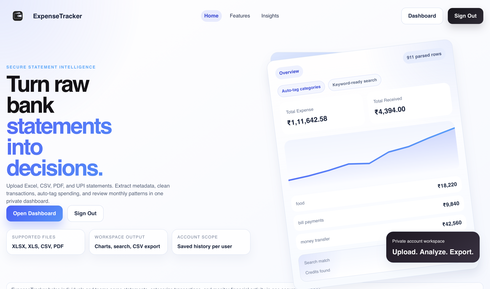
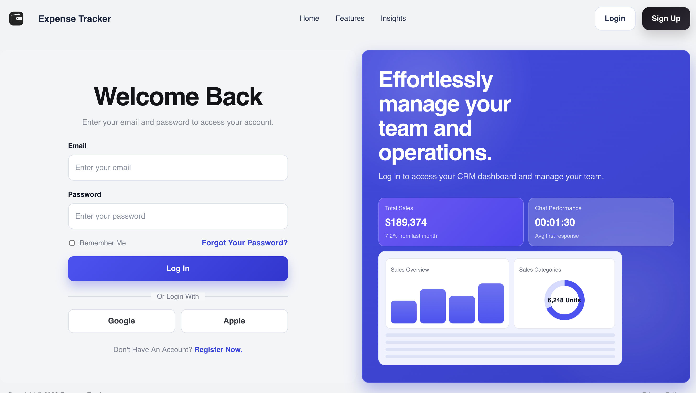
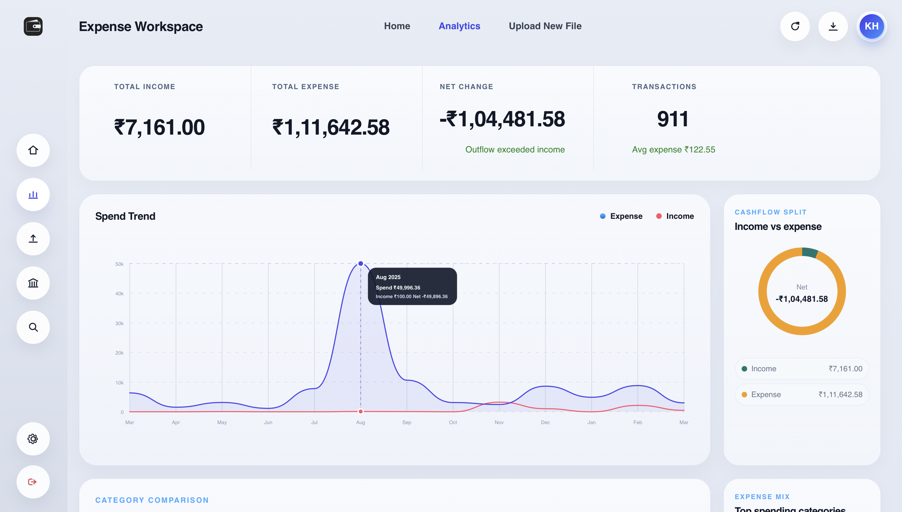
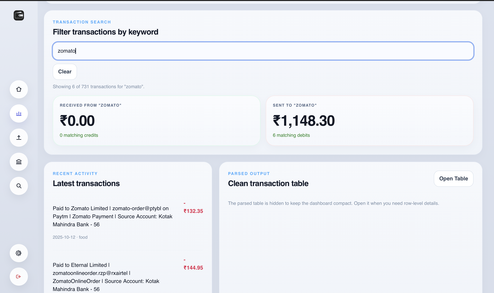
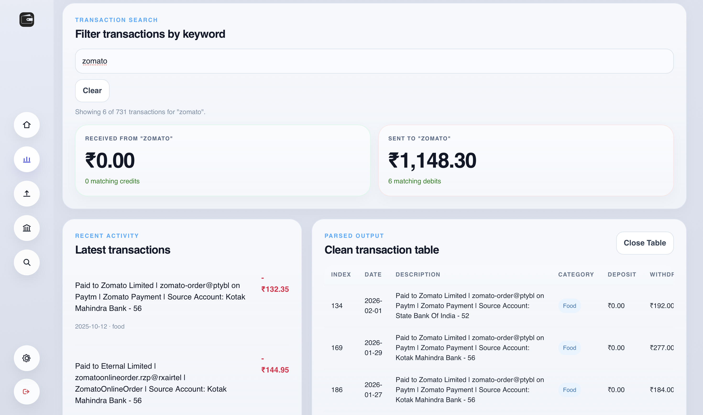

# ExpenseTracker

ExpenseTracker is a full-stack statement parsing and analytics workspace built with React, FastAPI, and PostgreSQL. It turns uploaded bank statements into structured transaction data, category-level insights, searchable history, and export-ready results.

## Product Tour

### Landing Experience

The public landing page introduces the app as a statement intelligence workspace focused on parsing, categorization, search, and export.



### Authentication Flow

Users can create an account or log in to access a private dashboard where statement runs and analytics are saved per user.



### Analytics Dashboard

After upload, the workspace surfaces portfolio-style analytics such as total income, total expense, net change, monthly spend trends, and cashflow breakdowns.



### Keyword Search Workflow

The dashboard supports keyword-driven transaction analysis so users can inspect spend against a merchant or pattern, then compare matching credits and debits instantly.



### Parsed Table Inspection

Users can expand into row-level parsed output to verify categorized transactions, dates, descriptions, and amounts before exporting the cleaned data.



## Why This Project Stands Out

- Built as a complete product, not just a parser script: upload, auth, history, analytics, and export all live in one workflow.
- Designed for real deployment with a Vite frontend, FastAPI API, PostgreSQL persistence, Alembic migrations, and production env configuration.
- Focused on practical financial workflows such as password-protected statement handling, transaction categorization, saved statement runs, and dashboard-style summaries.

## Core Features

- Secure user registration, login, profile lookup, and account deletion
- Statement upload and parsing for supported spreadsheet and PDF formats
- Saved statement history for authenticated users
- Analytics summaries including credits, debits, net change, monthly breakdowns, and category totals
- Searchable transaction tables and CSV export
- Responsive React workspace with public pages, auth flow, and application views

## Supported Inputs

Current parser implementations in the repo include:

- SBI statement parsing
- Kotak statement parsing
- Paytm statement parsing
- Password-protected workbook handling where supported

## Tech Stack

- Frontend: React 19, React Router, Vite
- Backend: FastAPI, Uvicorn
- Data layer: PostgreSQL, SQLAlchemy 2, Alembic
- File processing: pandas, openpyxl, pdfplumber, msoffcrypto-tool
- Deployment target: Vercel for frontend, Railway for backend and PostgreSQL

## Architecture

```text
React + Vite frontend
        |
        v
FastAPI application
        |
        +--> statement parsers and analytics pipeline
        |
        +--> auth and statement history APIs
        |
        v
PostgreSQL + Alembic migrations
```

## User Journey

1. A user signs in and uploads a bank statement in XLSX, XLS, CSV, or supported PDF form.
2. The backend detects the parser path, normalizes transactions, and computes analytics.
3. The frontend renders charts, totals, category summaries, and searchable transaction results.
4. Authenticated users can revisit saved statement history and reopen prior parsing runs.
5. Cleaned transaction data can be reviewed in-app and exported as CSV.

## Project Structure

```text
frontend/   React application, public pages, dashboard workspace, Vercel config
backend/    FastAPI app, parsers, SQLAlchemy models, Alembic migrations, Docker config
```

## Local Development

### Backend

```bash
cd backend
python3 -m venv venv
. venv/bin/activate
pip install -r requirements.txt
cp .env.example .env
uvicorn main:app --reload --host 0.0.0.0 --port 8002
```

### Frontend

```bash
cd frontend
npm install
cp .env.example .env
npm run dev
```

### Environment Notes

The repo keeps only:

- real local `.env` files for your machine
- `.env.example` files as safe templates

Production example values are documented inside the `.env.example` files instead of separate extra env files.

## Production Notes

- Set a strong `EXPENSE_TRACKER_AUTH_SECRET`
- Set explicit `EXPENSE_TRACKER_ALLOWED_ORIGINS` and `EXPENSE_TRACKER_TRUSTED_HOSTS`
- Disable docs in production with `EXPENSE_TRACKER_ENABLE_DOCS=false`
- Build the frontend with `npm run build`
- The backend can serve the built frontend automatically when `frontend/dist` exists and `EXPENSE_TRACKER_ENABLE_FRONTEND_SERVING=true`

## Recommended Deployment

This repository is prepared for a split deployment:

- Vercel for the frontend
- Railway for the backend API and PostgreSQL

### 1. Deploy the Backend on Railway

Create a Railway project from the `backend` directory.

Set these variables:

```bash
EXPENSE_TRACKER_ENV=production
EXPENSE_TRACKER_APP_NAME=ExpenseTracker
EXPENSE_TRACKER_AUTH_SECRET=replace-with-a-long-random-secret
EXPENSE_TRACKER_ENABLE_DOCS=false
EXPENSE_TRACKER_ALLOWED_ORIGINS=https://your-frontend-domain.vercel.app
EXPENSE_TRACKER_TRUSTED_HOSTS=your-backend-domain.up.railway.app
```

Notes:

- Railway provides `DATABASE_URL` automatically once PostgreSQL is attached
- Railway provides `PORT` automatically, and the backend supports that out of the box
- `backend/railway.toml` configures the healthcheck and restart policy
- The Docker startup flow runs `alembic upgrade head` before starting the API

### 2. Deploy the Frontend on Vercel

Create a Vercel project using the `frontend` directory as the root.

Set:

```bash
VITE_API_BASE_URL=https://your-backend-domain.up.railway.app
```

Notes:

- `frontend/vercel.json` includes an SPA rewrite so React Router routes resolve correctly on refresh
- After deploy, add the Vercel domain to `EXPENSE_TRACKER_ALLOWED_ORIGINS` on Railway

### 3. Final Production Checklist

- Confirm `https://your-backend-domain.up.railway.app/health` returns `200`
- Confirm login and registration work from the deployed frontend
- Confirm statement upload works against the deployed API
- Confirm statement history loads after refresh
- Confirm the favicon and browser title render correctly

## Verification

### Frontend

```bash
cd frontend
npm run lint
npm run build
```

### Backend

```bash
cd backend
python3 -m py_compile main.py
```

## Portfolio Notes

If you are showcasing this repo publicly, consider adding these before sharing it widely:

- a live demo URL once Vercel and Railway are connected
- 2 to 4 screenshots or a short GIF of the upload and analytics workflow
- a short section describing product decisions, parser challenges, and tradeoffs

## License

No license has been added yet. If you want others to reuse the code, add an explicit open-source license. If you want to keep reuse restricted while still showing the project publicly, leaving the repo without a license is acceptable.
